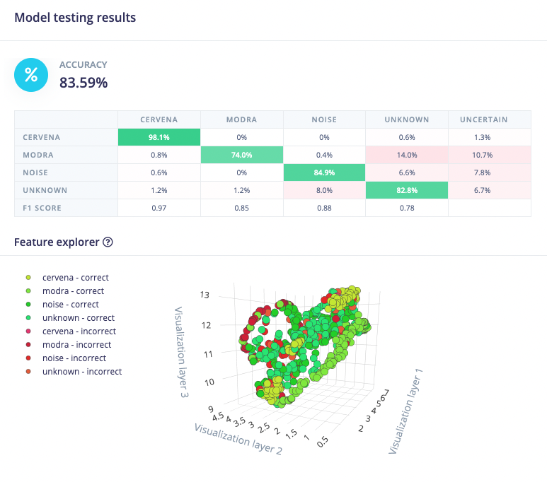

# thunderboard-sense-voice-command

## Popis
Práce má využívat machine learning model vytvořený pomocí platformy Edge Impulse k rozpoznávání hlasových příkazů na Thunderboard Sense 2 kitu. Má rozpoznávat 2 hlasové příkazy "červená" a "modrá" a dle toho rozsvítit LED diody červeně, resp. modře.

V současné době však, po nasazení softwaru na kit, kit pomocí ML modelu pouze dokola vyhodnocuje jeden staticky definovaný test sample. Nepovedlo se mi totiž získat data z mikrofonu ICS-43434, který používá I2S rozhraní, které v Mbed není nativně podporované.

## Postup
Práci jsem začal prozkoumáním platformy Edge Impulse (dále jen EI), která je použita k výrobě ML modelu na rozpoznávání příkazů. Po ujištění, že je vhodná pro účely tohoto projektu jsem začal sbírat data pro model.

Data jsem sbíral skrze mikrofon v laptopu, kdy jsem v rozumných intervalech opakoval klíčovou frázi (slovo červená nebo modrá). Hlasové záznamy jsem poté rozstříhal na jednosekundové záznamy s frází a zároveň randomly shiftnul, aby fráze nebyla vždy uprostřed. Aby byl model robustnější, poprosil jsem také kamaráda a kamarádku, aby mi nahráli podobné záznamy. Dohromady jsem po rozdělení záznamů sesbíral zhruba 13 minut dat pro každou frázi. To jsem doplnil ještě unknown a noise záznamy ze staženého data setu a rozdělil poměrem zhruba 80/20 na training a test data.

Pomocí těchto dat jsem skrze EI platformu vytrénoval Keras machine learning model. Tento model má na testovacích datech průměrně 83,59% přesnost. Na obrázku níže můžeme vidět, že ale na datech pro frázi červená má až 98% přesnost.

Po tomto jsem zkusil nasadit model na kit. Nejdříve skrze přímo podporovaný EI firmware pro SiLabs Thunderboard Sense 2. Poté skrze optimalizovanou C++ knihovnu, kterou EI platforma přímo vygeneruje přímo pro váš model. Pomocí [návodu](https://docs.edgeimpulse.com/docs/deployment/running-your-impulse-locally/running-your-impulse-mbed) jsem knihovnu po chvíli úspěšně integroval a otestoval přidáním staticky definovaného test samplu. V tomto stádiu je projekt i nyní.

Poté jsem se totiž neúspěšně snažil získat data z mikrofonu kitu. Zkoušel jsem i zprovoznit Simplicity studio, které je ale hrozné a poměrně dlouhou dobu mi trvalo pouhé zprovoznění studia samotného. I poté se mi, ale ani skrze nějaké example projekty (např. [EdgeImpulse projekt](https://github.com/edgeimpulse/firmware-silabs-thunderboard-sense-2)) zprovoznit získávání dat z mikrofonu. Silicon Labs totiž skrze svou platformu Gecko poskytuje [interface přímo pro ICS-43434 mikrofon](https://docs.silabs.com/mcu/5.9/efr32bg22/group-Mic-i2s). Použití této knihovny mimo Simplicity studia se mi však nepovedlo. 
Zkoušel jsem také integrovat [tuto knihovnu](https://github.com/pea-pod/mbed-stm32-i2s), ale i tam jsem selhal. Projekt tak tedy skončil v tomto bodu.